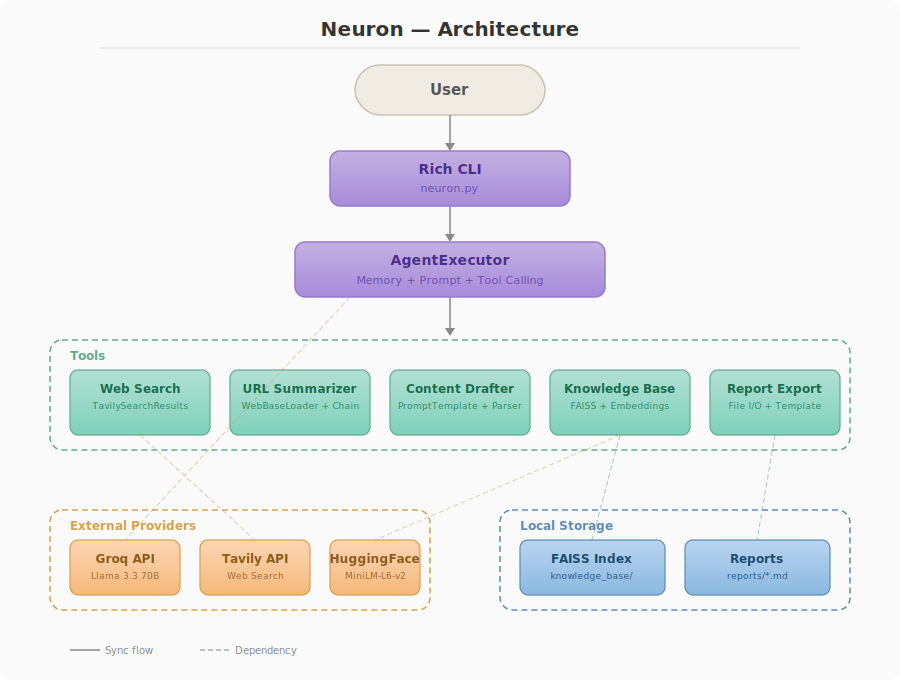

# `Neuron`

**AI-Powered Research & Workflow Assistant** - A CLI tool built with LangChain that helps you research topics, summarize articles, draft content, manage a personal knowledge base, and export reports - all from your terminal.

Built as a hands-on learning project to apply core LangChain concepts in a real application.

---

## ✨ Features

| Tool                   | What it does                         | LangChain Concepts                                |
| ---------------------- | ------------------------------------ | ------------------------------------------------- |
| 🔍 **Web Search**      | Search the web for real-time info    | Built-in Tools (TavilySearchResults)              |
| 📄 **URL Summarizer**  | Fetch & summarize any webpage        | Document Loaders, Chains (`load_summarize_chain`) |
| ✍️ **Content Drafter** | Draft emails, LinkedIn posts, tweets | PromptTemplate, PydanticOutputParser, LCEL        |
| 💾 **Knowledge Base**  | Save & retrieve info using RAG       | Text Splitters, Embeddings, FAISS Vector Store    |
| 📊 **Report Exporter** | Generate markdown reports to file    | Custom Tools with file I/O, StrOutputParser       |

**Core infrastructure:** Agent with tool-calling (`AgentExecutor`, `create_tool_calling_agent`), Conversational Memory (`ConversationBufferWindowMemory`), Rich CLI interface.

## Architecture

---



## 🚀 Quick Start

### 1. Clone & Install

```bash
git clone https://github.com/vinayakpareek-0/Neuron.git
cd Neuron
pip install -r requirements.txt
```

### 2. Set up API keys

```bash
cp .env.example .env
```

Edit [.env](cci:7://file:///c:/Users/vpj16/OneDrive/Desktop/Projects/05_langchain_quickstart_proj/.env:0:0-0:0) and add your keys:

```
GROQ_API_KEY=your_groq_key_here
TAVILY_API_KEY=your_tavily_key_here
```

- Get a free Groq key at [console.groq.com](https://console.groq.com)
- Get a free Tavily key at [tavily.com](https://tavily.com)

### 3. Run

```bash
python neuron.py
```

---

## 💬 Example Usage

```
You > What are the latest trends in AI agents?
Neuron > [searches the web and responds with current info]

You > Summarize this page: https://en.wikipedia.org/wiki/LangChain
Neuron > [fetches the page and gives a concise summary]

You > Draft a LinkedIn post about RAG systems
Neuron > [returns structured content with title, body, and hashtags]

You > Save this to my knowledge base: RAG stands for Retrieval Augmented Generation...
Neuron > Saved 1 chunk(s) to knowledge base.

You > What do I know about RAG?
Neuron > [retrieves relevant info from your saved knowledge]

You > Generate a report about AI agents
Neuron > Report saved to: reports/ai_agents_20260324_1300.md
```

---

## 📁 Project Structure

```
├── neuron.py                  # CLI entry point + agent setup
├── src/
│   ├── config.py              # LLM config (Groq) + system prompt
│   ├── agent.py               # Agent builder with memory + prompt template
│   └── tools/
│       ├── web_search.py      # Tavily web search
│       ├── url_summarizer.py  # WebBaseLoader + summarize chain
│       ├── content_drafter.py # PromptTemplate + PydanticOutputParser
│       ├── kb.py              # FAISS vector store (save + search)
│       └── report_exporter.py # Markdown report generator
├── knowledge_base/            # FAISS index (auto-created, gitignored)
├── reports/                   # Generated reports (auto-created, gitignored)
├── requirements.txt
├── .env.example
└── .gitignore
```

---

## 🧩 LangChain Concepts Covered

- **Chat Models** — `ChatGroq`
- **Prompt Templates** — `ChatPromptTemplate`, `PromptTemplate`
- **Agents** — `create_tool_calling_agent`, `AgentExecutor`
- **Memory** — `ConversationBufferWindowMemory`
- **Tools** — Built-in tools, `@tool` decorator for custom tools
- **Chains** — `load_summarize_chain`, LCEL pipe syntax (`prompt | llm | parser`)
- **Output Parsers** — `PydanticOutputParser`, `StrOutputParser`
- **Document Loaders** — `WebBaseLoader`
- **Text Splitters** — `RecursiveCharacterTextSplitter`
- **Embeddings** — `HuggingFaceEmbeddings` (all-MiniLM-L6-v2)
- **Vector Stores** — `FAISS` (local, no server needed)

---

## 🛠 Tech Stack

- **Python 3.10+**
- **LangChain** — Framework
- **Groq** (Llama 3.3 70B) — LLM Provider (free tier)
- **Tavily** — Web Search API
- **FAISS** — Local Vector Store
- **HuggingFace** — Embeddings (runs locally)
- **Rich** — CLI Formatting

---

## 📝 License

MIT
